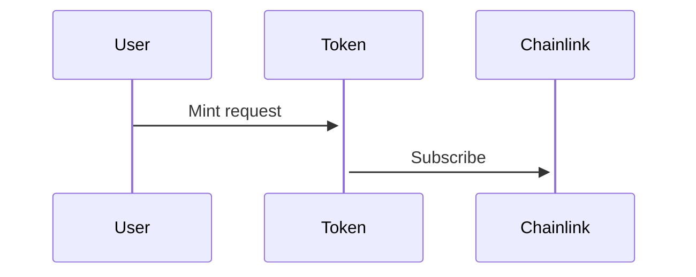

# Chainlink

## VRF v2

Via chainlink we will use randomness for the design of the generative rarity of each creature, each DNA will be in charge to determine advantage and traits of each element

## Diagrams

### Create Creature and Generate DNA

## Stacking

## References
* [Random Numbers: Using Chainlink VRF](https://docs.chain.link/docs/intermediates-tutorial/)
