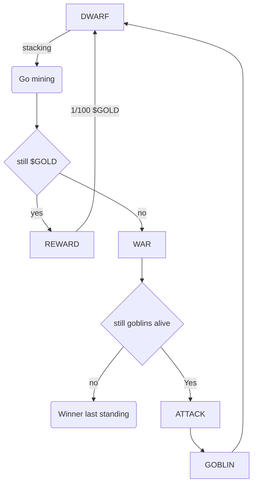

# Dwarfs vs Goblins [draft v1.0.0]

On a remote metaverse, DWARFS mine $GOLD in a abandoned mines while GOBLINS look for oportunities to steal their precious rewards.

Once they depleted the resources and used them to hire more creatures on their side, the battle commence.

Game is risk protocol for NFTs using pseudo randomness to steal or mine `$GOLD`
use it to hire more creatures and finally set the battle to the last standing (END OF GAME)

Each group can attack each other once a creature has no more HP I'll DIE in a final Battle where a last standing creature will live to be the last to tell the story.

This history will be written and perpetuate on chain for ever.

GOBLINS are good to steal but not so good for war, in the other side DWARFS are war machines but while mining they have the limitations of their weight and slow speed so It's a disadvantage agains greedy GOBLINS

Last standing reward: Wait for it

## Mechanics

### Spawn

* There will only ever be 10,000 GEN0, minted for 0 ETH each (only gas), GEN1, GEN2, GEN3 will be only purchased via `$GOLD`.

### Harvesting

* DWARF can be staked in the MINE to earn `$GOLD` for 100 blocks till they get tired and wait to come back UNSTAKE CLAIM
* If a DWARF RETURNS (Unstack) from the MINE, the GOBLINS try to steal all of It's accumulated `$GOLD`

### Ways of dying
* If DWARF does not MINE (Unstack) for 1 MONTH (6154 * 30 blocks) I'll DIE of STARVATION
* If GOBLIN does not STEAL (Unstack) for 3 MONTHS (6154 * 90 blocks) I'll DIE of PUNISHMENT (By the other GOBLINS)

### Final Battle
* You can ATTACK another creature of a different race, with a chance of KILL or substract HP (Still in discussion)

### End of game

* Creatures can't ATTACK till 2/3 of the supply is reached
* When MINE $GOLD supply is depleted, I'll crash forcing the cratures to only ATTACH each other
* When a creature ATTACK another one will reduce his HP till KILL's it

## Total supply

GEN0 Tokens: 10.000 for 0.0 ETH
GEN1 Tokens: 10.000 for 100 `$GOLD`
GEN2 Tokens: 10.000 for 200 `$GOLD`
GEN3 Tokens: 10.000 for 400 `$GOLD`
`$GOLD` Total supply: 1.000.000

## Creatures, Races, Atributes and Rarity

Attack base: 4d6
Defense base: 4d6
Hit points base: 100 + 4d6

Ordinary: 50/100
Common: 21/100
Rare: 13/100
Very rare: 8/100
Epic: 5/100
Legendary: 3/100

### Dwarf

Chance of spawn (on MINT): 1d3 = 3

* Attack: `Attack base` + `rarity modifier`
* Deffense: `Defense base` + `rarity modifier`
* Hit Points: `Hit points base`  + `rarity modifier`

*Rarity modifier*:

| Rarity    | Attack | Deffense | Hit Points | 
|-----------|--------|----------|------------|
| Ordinary  | +2     | +3       | +1         |
| Common    | +3     | +5       | +3         |
| Rare      | +5     | +8       | +3         |
| Very rare | +8     | +13      | +5         |
| Epic      | +13    | +21      | +8         |
| Legendary | +21    | +21      | +13        |

### Goblin

Chance of spawn (on MINT): 1d3 = 1,2

* Attack: `Attack base` + `rarity modifier`
* Deffense: `Defense base` + `rarity modifier`
* Hit Points: `Hit points base`  + `rarity modifier`

*Rarity modifier*:

| Rarity    | Attack | Deffense | Hit Points | 
|-----------|--------|----------|------------|
| Ordinary  | +1     | +1       | +1         |
| Common    | +1     | +1       | +1         |
| Rare      | +1     | +3       | +3         |
| Very rare | +3     | +5       | +5         |
| Epic      | +5     | +8       | +8         |
| Legendary | +8     | +13      | +13        |

* Attack: DNA#ATTACK 1d12
* Deffense: DNA#DEFENCE 1d12
* Hit Points: DNA#HP 1D100

### Atributes

For simplicity only `name: string`, `Race: enum` and `dna: uint256` will be introduced.

| Name | Type    | Source  |
|------|---------|---------|
| Name | String  | mint    |
| Race | Enum    | 0, 1    |
| DNA  | uint256 | uint256 |

## Limitations

Given the intense use of randomness, and stacking unstacking mechanics this could be a technical impediment in high gas evm networks, we might need to fine tune the balance of the game as the supply and resources availables