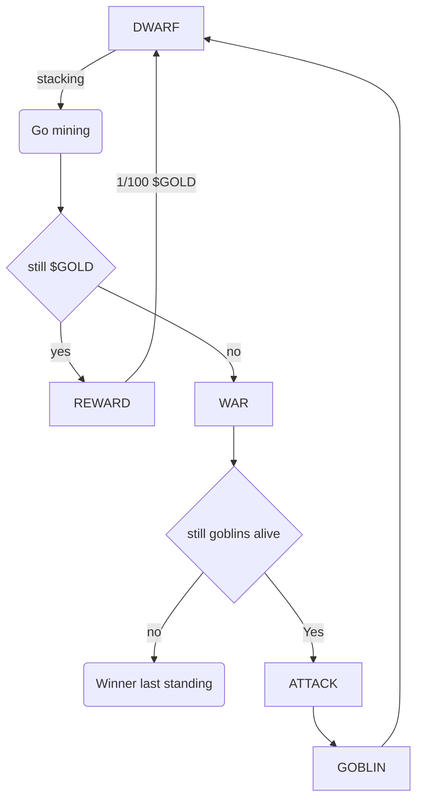

# Dwarfs vs Goblins [draft v1.0.0]

On a remote metaverse, DWARFS mine $GOLD in a abandoned mines while GOBLINS are looking for opportunities to steal their precious rewards.
Once a player depleted all resources from a mine they can used them to recruit more creatures (Dwarfs/Goblins) to strengthening there fraction.

Our Game is risk protocol for NFTs using pseudo randomness to steal or mine `$GOLD` resources.
Those are then used re-enforce due recruitment of creatures and finally set the battle to the last standing (END OF GAME).

Each group can attack one another once a creature has no more HP I'll DIE in a final Battle where a last standing creature will live to be the last to tell the story.

Victors history will be written and recorded as on-chain record. For everyone to see the and observe and review the battle.

GOBLINS are good to steal but not so good for war, in the other side DWARFS are war machines but while mining they have the limitations of their weight and slow speed so It's a disadvantage agains greedy GOBLINS

Last standing characters will be reward: Stay tuned

## Mechanics

### Spawn

* There will only ever be 10,000 GEN0, minted for 0 ETH each (only gas), GEN1, GEN2, GEN3 will be only purchased via `$GOLD`.

### Harvesting

* DWARF can be staked to a mine MINE to earn `$GOLD` for 100 blocks till they get tired and wait return home (UNSTAKE CLAIM)
* If a DWARF RETURNS (UNSTAKES) from the MINE, the GOBLINS have a change to steal some/all of It's accumulated `$GOLD`.

### Ways of dying

* If DWARF doesn't MINE but is stilled (STAKED) for 1 MONTH (6154 * 30 blocks). I'll DIE of STARVATION
* If GOBLIN don't STEAL (UNSTAKE) for 3 MONTHS (6154 * 90 blocks) I'll DIE of PUNISHMENT (By the other GOBLINS)

### Final Battle
* Everyone can ATTACK another creature of a opposite race, with a chance of KILL or subtract HP (Still in discussion)
* collected resource may be used to recover HP

### End of game mechanic's

* Creatures can't ATTACK till 2/3 of the supply is reached
* When MINE $GOLD supply is depleted, I'll crash forcing the creatures to only ATTACH each other
* When a creature ATTACK another one another they will reduce HP till KILL's it

## Total supply

### NFT

GEN0 Tokens: 10.000 for 0.0 ETH
GEN1 Tokens: 10.000 for 100 `$GOLD`
GEN2 Tokens: 10.000 for 200 `$GOLD`
GEN3 Tokens: 10.000 for 400 `$GOLD`

### Gold Tokens

GEN1: `$GOLD`: 1.000.000
GEN2: 2.000.000
GEN3: 4.000.000

## Creatures, Races, Attributes and Rarity

Attack base: 4d6
Defense base: 4d6
Hit points base: 100 + 4d6

Ordinary: 50/100
Common: 21/100
Rare: 13/100
Very rare: 8/100
Epic: 5/100
Legendary: 3/100

### Dwarf

Chance of spawn (on MINT): 1d3 = 3

* Attack: `Attack base` + `rarity modifier`
* Defense: `Defense base` + `rarity modifier`
* Hit Points: `Hit points base`  + `rarity modifier`

*Rarity modifier*:

| Rarity    | Attack | Defense | Hit Points | 
|-----------|--------|----------|------------|
| Ordinary  | +2     | +3       | +1         |
| Common    | +3     | +5       | +3         |
| Rare      | +5     | +8       | +3         |
| Very rare | +8     | +13      | +5         |
| Epic      | +13    | +21      | +8         |
| Legendary | +21    | +21      | +13        |

### Goblin

Chance of spawn (on MINT): 1d3 = 1,2

* Attack: `Attack base` + `rarity modifier`
* Defense: `Defense base` + `rarity modifier`
* Hit Points: `Hit points base`  + `rarity modifier`

*Rarity modifier*:

| Rarity    | Attack | Defense | Hit Points | 
|-----------|--------|----------|------------|
| Ordinary  | +1     | +1       | +1         |
| Common    | +1     | +1       | +1         |
| Rare      | +1     | +3       | +3         |
| Very rare | +3     | +5       | +5         |
| Epic      | +5     | +8       | +8         |
| Legendary | +8     | +13      | +13        |

* Attack: ATTACK 1d12
* Defense: DEFENCE 1d12
* Hit Points: HP 1D100

### Alternate mechanic for death
Hit points total + Defense: reduce chance of DEATH per ATTACK
Attack total: increase chance of DEATH per ATTACK

### Attributes

For simplicity only `name: string`, `Race: enum` and `dna: uint256` will be introduced.

| Name | Type    | Source  |
|------|---------|---------|
| Name | String  | mint    |
| Race | Enum    | 0, 1    |
| DNA  | uint256 | uint256 |

## Limitations

Given the intense use of randomness, during staking/unstaking mechanics randomness
may be gamed from players. We envision a range of mechanisms which allow
this process more efficient.
On approach could be that users have to earn there place in the mine (which will in turn request randomness)
We could use packing methods to get many random numbers from a single seed. [approach](https://ethereum.stackexchange.com/questions/112331/gas-efficient-way-to-generate-multiple-different-random-numbers?rq=1)

Testing:
* Mathematical model
* Balance
* Simulation
* Chain link subscribe getRandomWork unit 
